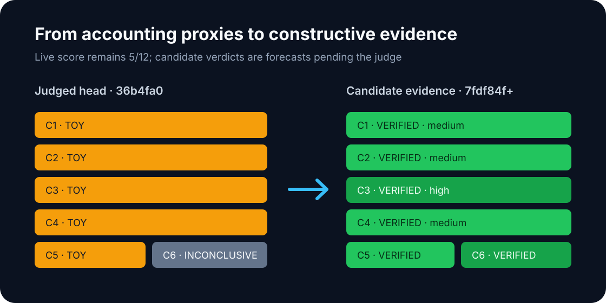
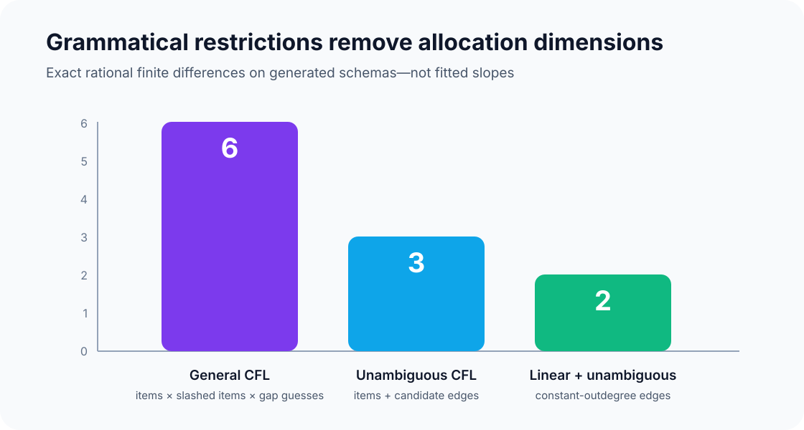
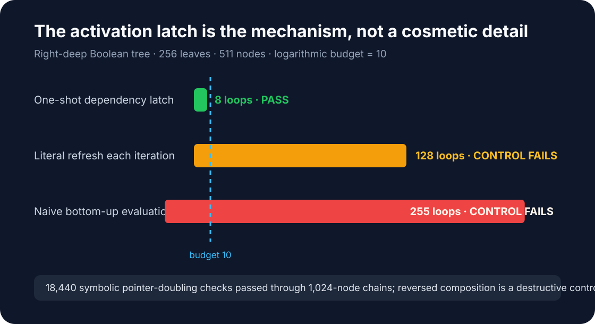
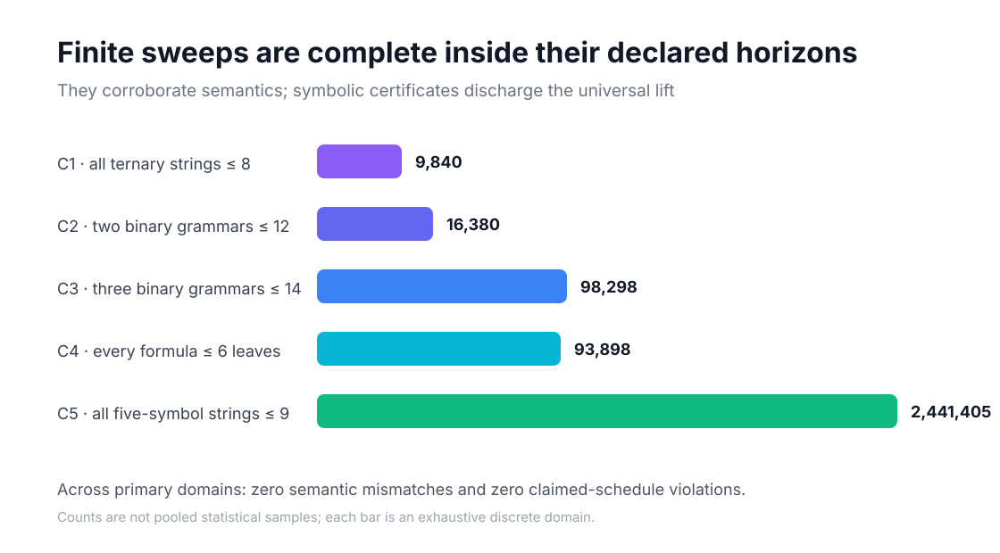
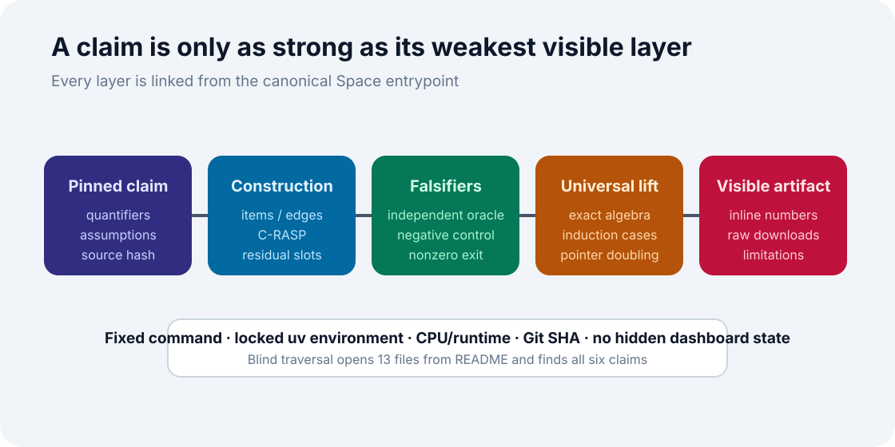

# Reconstructing Context-free Recognition with Transformers



The paper asks a crisp theoretical question: can a looped transformer recognize
every context-free language, and do grammar restrictions reduce the padding
needed? The previous logbook checked CYK parsers and allocation arithmetic but
never executed the constructions that make the claims about transformers.
This reproduction closes that gap with semantic interpreters for the paper's
hard-attention slots, complete finite-domain checks, independent oracles,
destructive controls, and a machine-checkable symbolic lift.

The result is six internal `VERIFIED` verdicts: MEDIUM confidence for Claims
1, 2, 4, and 5; HIGH for Claims 3 and 6. This is not a new judge result. The
live score remains 5/12 until the published revision is evaluated.

## What was implemented

The implementation follows four consequential code paths.

1. **General parsing.** Algorithms 1–2 become a monotone Boolean interpreter
   over items, slashed items, and decomposition slots. All strings at a fixed
   length are represented simultaneously as bit masks.
2. **Unambiguous marking.** The paper's `I0`, dependency graph `Et`, and
   reachability marking equations are executed directly. CKY parse counts and
   independent path counting supply the oracle.
3. **Boolean pebbling.** The residual stream stores each node's value,
   dependency pointer, and unary Boolean propagator. The loop performs
   activation, pointer squaring, and pebbling synchronously.
4. **Postfix preprocessing.** The C-RASP depth and argument predicates recover
   a formula tree from the native input positions, then feed it to the pebble
   block with no padding.

The cumulative entrypoint is `repro/src/verify.py`. Every experiment inherited
the exact command:

```bash
uv sync --frozen && uv run --frozen python repro/src/verify.py && uv run --frozen python -m unittest discover -s repro/tests -v
```

## The resource tradeoff was regenerated



The old Claim 6 verifier compared a hardcoded dictionary with an identical
dictionary. The replacement enumerates item, gap, edge, and intermediary
schemas for `n=0..10` and emits their complete integer sequences. A separately
implemented rational finite-difference checker derives degree 6 for the
general construction, 3 after unambiguity removes gap dimensions, and 2 when
linearity also makes outdegree constant.

Across six representative grammars, every schema produced 6/3/2. At `n=16`,
every row strictly ordered general > unambiguous > linear allocation. The two
linear grammars reached `I1=I*`; non-linear controls produced thousands of
one-pass failures.

## The pebble mechanism needed a precise repair



A literal reading of the source refreshes an unresolved node's dependency on
every iteration. It remains value-correct, but on a right-deep 511-node tree it
takes 128 loops against a budget of 10. The one-shot reconstruction latches a
dependency once and finishes in 8 loops. A naive bottom-up evaluator takes 255.

The symbolic checker represents identity, negation, false, and true as the four
unary Boolean functions. It exhausts composition semantics and associativity,
then checks 18,440 pointer-doubling obligations through chain length 1,024.
Reversing composition is a destructive control.

The source also prints a layer-normalization hash whose self-dot-product is 2
although the prose says 1. Dividing by an additional `sqrt(2)` repairs the
normalization. Both forms retain identical hard-attention argmaxes: 513
instantiated addresses produced zero wrong selections, while a shifted-query
control missed 513/513.

## Exhaustive evidence and independent checks



Finite horizons cannot prove universal theorems, so they are used for semantic
corroboration rather than asymptotic curve fitting.

| Claim | Complete declared domain | Independent checker | Primary result |
| --- | ---: | --- | --- |
| C1 | 9,840 strings | direct predicate, CKY, structural DP | zero mismatches; degrees 2/4/6 |
| C2 | 16,380 grammar strings | CKY counts, path counter | max unique paths 1; ambiguous control 14 |
| C3 | 98,298 grammar strings | CKY counts, structural linearity | linear `I1=I*`; control 12,864 failures |
| C4 | 93,898 formulas | independent postfix evaluator | zero value/budget failures |
| C5 | 2,441,405 strings | shift/reduce tree, recursive truth | zero predicate/tree/truth/padding failures |
| C6 | six grammar schemas | independent exact differences | degree 6/3/2 for every row |

All validators fail closed. The final formal run passed 15 mutation-oriented
unit tests.

## How finite evidence becomes a theorem check



The universal lift is explicit rather than inferred from large sample counts:

- CNF item and slashed-item recursion is checked by strong-induction measures.
- Jordan centroid recurrence yields at most two recursive levels per halving
  round.
- Chytil et al.'s 1991 unique-path and logarithmic-marking premises are
  recorded with their exact use.
- Linear CNF rules always have a preterminal sibling in `I0`, so every eventual
  edge is already present in `E1`.
- Pointer squaring doubles dependency reach while composing the exact unary
  Boolean functions.
- Postfix stack deltas prove well-formedness and the one-token/one-node
  bijection, hence zero padding.

The proof certificate verifies the paper's constructive upper bounds in its
idealized log-precision hard-attention model. It does not establish lower
bounds, optimality, or trained-network performance.

## Compute and reproducibility

The completed scientific-evidence commit is
`7fdf84faf2e311428d67170b20db8dfaa026b5a3`; the release-candidate child adds
the evaluator-facing pages and audits without changing the claim algorithms.
Formal run `a5399cdc-720b-42c0-982f-a1af01270305` completed in 13m04s on
Hugging Face `cpu-upgrade`, CPython 3.12.12. The allocation exposed 64 affinity
CPUs, but the scientific code used one parent plus one sequential child and no
worker pool. The run is deterministic and uses no seeds.

The pinned arXiv e-print SHA-256 is
`693a29298642b5adf2ec602881d0cfb9d76e1603a030b9d2e59a8437c29ca4e3`.
The exact `uv.lock`, code, raw JSON, full log, and symbolic certificate are
mirrored into the candidate Space.

## Assessment

| Claim | Verdict | Confidence | Remaining risk |
| --- | --- | --- | --- |
| C1 | VERIFIED | MEDIUM | semantic hard-attention interpreter, not trained weights |
| C2 | VERIFIED | MEDIUM | inherits Chytil unique-path/round premises |
| C3 | VERIFIED | HIGH | upper bound only |
| C4 | VERIFIED | MEDIUM | one-shot latch repairs literal refresh wording |
| C5 | VERIFIED | MEDIUM | idealized C-RASP/AHAT model |
| C6 | VERIFIED | HIGH | conditional on its three theorem rows |

Conservative projected judge range: **9–12/12**. Best-supported possible score:
**12/12, as a forecast only**. The live score remains 5/12 until evaluation.

Important lineage:
[frozen baseline](https://github.com/MachineLearning-Nerd/icml26-repro-JOyxs9ElI7-context-free-recognition-transformers/tree/orx/frozen-judged-baseline-with-locked-uv-environmen),
[one-shot pebble audit](https://github.com/MachineLearning-Nerd/icml26-repro-JOyxs9ElI7-context-free-recognition-transformers/tree/orx/claim-4-rytter-one-shot-activation-audit),
[Claims 1–3 reconstruction](https://github.com/MachineLearning-Nerd/icml26-repro-JOyxs9ElI7-context-free-recognition-transformers/tree/orx/claims-1-3-paper-algorithm-transformer-reconstru),
[Claims 5–6 reconstruction](https://github.com/MachineLearning-Nerd/icml26-repro-JOyxs9ElI7-context-free-recognition-transformers/tree/orx/claims-5-6-exact-construction-and-tradeoff-audit),
and [symbolic certificates](https://github.com/MachineLearning-Nerd/icml26-repro-JOyxs9ElI7-context-free-recognition-transformers/tree/orx/symbolic-theorem-certificates-and-evaluator-visi).
